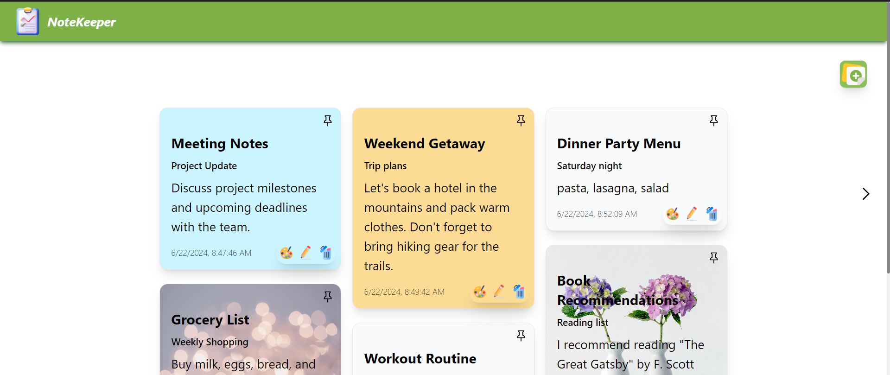
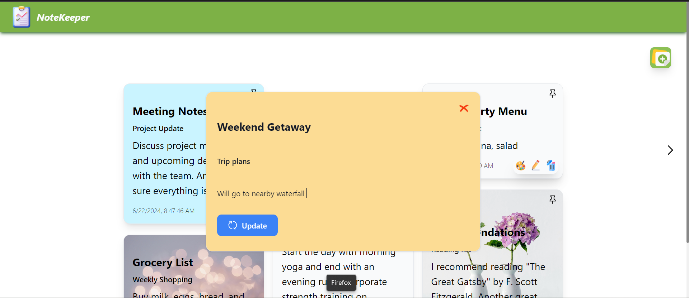
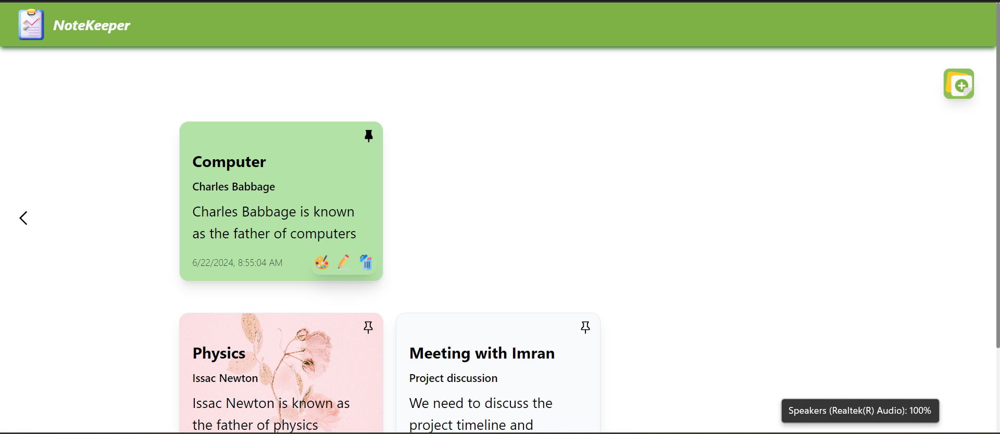

# NoteKeeper

- [NoteKeeper](#notekeeper)
  - [UI](#ui)
  - [Features](#features)
    - [Responsive Design](#responsive-design)
    - [Pagination](#pagination)
  - [Note Management](#note-management)
  - [Credits](#credits)

NoteKeeper is a responsive and user-friendly note-taking application. NoteKeeper is designed to help keep track of thoughts, ideas, and tasks in an organized manner. With its simple UI, one can easily add, edit, delete, and customize notes.

## UI

1. Has a navbar with logo. A add icon button on top right of page to add a note.
2. Has beautiful animations on hovering a note
3. Has beautiful smooth animation when open or refresh the page.
4. Has smooth opening of note when clicking on edit.

## Features

### Responsive Design

Optimized for both desktop and mobile devices.

### Pagination

Each page displays a maximum of 6 notes. When 6 notes are already present on a page, a new page is created for additional notes.

## Note Management

Easily edit, delete, pin and change the background color or image of notes to suit preferences.

## Credits

This application is build using Next.js and Tailwind CSS. Icons are taken by [flaticons](https://www.flaticon.com) as png images and [react-icons](https://react-icons.github.io/react-icons) library. For more advanced animation [framer](https://www.framer.com/motion/introduction) library is used.
